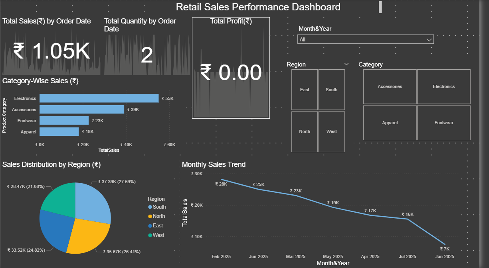

# Retail Sales Data Analysis

## Project Overview

The Retail Sales Data Analysis project is an end-to-end data analytics case study designed to explore sales performance, customer purchasing behavior, and product trends using historical retail data. The project focuses on extracting business insights that can support data-driven decision-making in a retail environment.

## Objectives

- Perform data cleaning and preprocessing on raw sales data
- Conduct exploratory data analysis (EDA) using Python
- Identify trends and patterns in product sales and customer behavior
- Generate key performance indicators (KPIs) for business insights
- Create visualizations to support findings and recommendations

## Tools and Technologies Used

- Python  
- Pandas and NumPy for data manipulation  
- Matplotlib and Seaborn for data visualization  
- Jupyter Notebook  
- Excel (used for cross-checking results)

## Data Cleaning Summary

- Removed duplicates and missing values  
- Standardized column naming and formatting  
- Converted date fields to appropriate datetime formats  
- Filtered outliers and corrected inconsistent entries

## Key Insights

- Identified best-selling and underperforming products  
- Analyzed monthly and seasonal trends in sales performance  
- Discovered regional differences in sales volume and revenue  
- Explored customer purchase frequency and behavior  
- Highlighted improvement opportunities in discount strategies and product focus

## Visualizations Included

- Monthly Sales Trends  
- Top Products by Revenue  
- Sales by Region or Country  
- Customer Purchase Distribution  
- Revenue vs Discount Relationship

## Project Outcomes

- Developed strong data cleaning and EDA skills  
- Built a full analysis pipeline from raw data to business insights  
- Improved ability to communicate findings with visualizations  
- Created a portfolio-ready analytics project to demonstrate core skills

## Contact

R. Nagarjuna  
Email: arjunravella108@gmail.com  
Phone: +91 7095740732  
LinkedIn: https://www.linkedin.com/in/R-Nagarjuna  
GitHub: https://github.com/RAVELLANAGARJUNA

